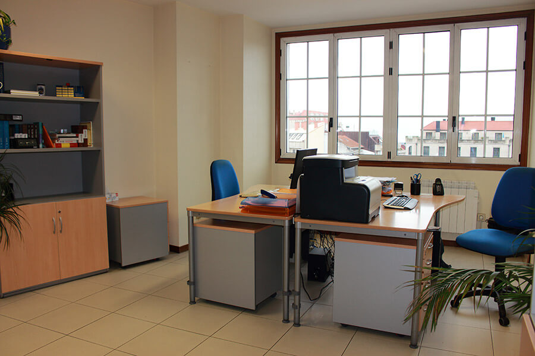
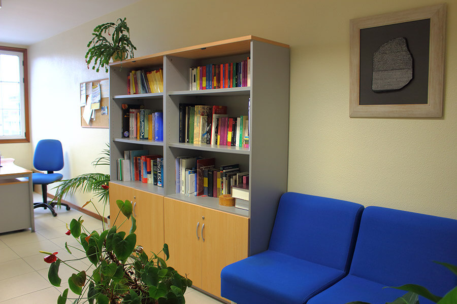
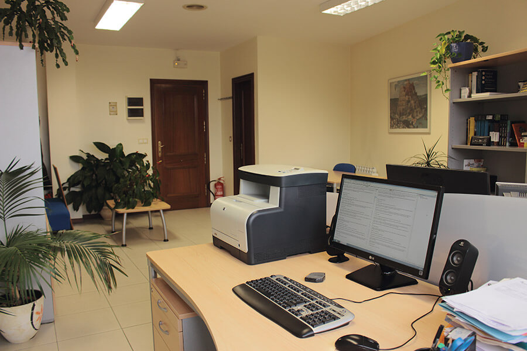
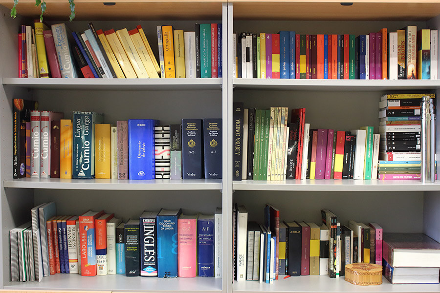
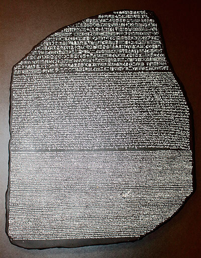

# Rosetta Traducción, Interpretación e Servicios Lingüísticos, S. L. L.

## Qui som

Rosetta és una empresa de traducció i interpretació que respon a les demandes tant de clients particulars com d'empreses. Combinem l'experiència, la formació especialitzada i la professionalitat per oferirvos un servei de qualitat a l'alçada de les vostres expectatives

Us convidem a navegar pel nostre web per explorar les competències lingüistiques que Rosetta posa a la vostra disposiciò. Si distigeu un estudi personal de les vostres necesitats especifiques, no dubteu a posar-vos en contacte amb nosaltres sense cap compromis.

 

 

-----

 

## Com treballem

En el teixit econòmic i professional del món en què vivim l'especialització professional és un valor en alça, i assignar cada tasca al professional adequat és un estalvi de temps i de diners. Per tant, quan sorgeixen necessitats interlingüistiques, el pas lògic és recórrer a una empresa especialitzada en traducció i interpretació. Rosetta respon a aquestes necessitats tot oferint qualitat i professionalitat en els seus serveis.

El nostre equip de professionals us garanteix la qualitat que només pot provenir d'una formació universitària especialitzada i el valor afegit d'una àmplia experiència. Ecolliu la serietat dels terminis complerts, la flexibilitat dels formats a la carta, la transparència dels pressupostos personalizats: Rosetta és la trnaquil·litat de saber que s'está en mans de professionals.

 

 

-----

 

## Serveis

El món del segle XXI, és plurilingüe i multicultural. Rosetta respon a les demandes sorgides d'aquesta realitat i ofereix tot un ventall de serveis dissenyats per ultrapassar les fronteres lingüistiques i culturals.

Des del titol universitari estranger que destigeu homologar, fins a la reunió laboral amb un importador potencial per la flamant pàgina web multilingüe de la vostra empresa o el manual d'instruccions de l'ultima adquisició tecnològica: Rosetta respon oferint-vos exactament alló que necessiteu.

Seleccioneu el tipus de servei que destigeu i obtindreu més informació al respecte:

- Traducció
- Interpretació
- Serveis lingüistics

 

### Traducció

La tradució és el pas d'un text escrit a una llengua diferent. Des de la memòria anual de la vostra societat mercantil,als informes mèdics que us sol·licita la vostra companya s'assegurats: a la vida sorgeixen constantment necessitats de traducció, Rosetta és la respota professional a adquestes necessitats.

- Totes les combinacions de llengües: des de les més habituals (ex. Anglès-espanyol) fins les més exòtiques (ex. Indonesi-francès)
- Múltiples camps d'especialització: traducció académica, médica, comercial, financiera, turística...
- Formats i suports a la carta: paper, correu electrònic, fax, CD...
- Traducció jurada: amb la certificació oficial de traductors habilitats per les autoritats. 
- Terminis a la vostra mida: des de la traducció urgent d'ultima hora fins a projectes de diversos mesos de durada.

 

### Interpretació

La interpretació (traducció oral) consisteix a traslladar a un altre idioma les paraules d'un parlant. Des d'una reunió de negocis amb un importador potencial dels vostres productes, fins a la venda d'una propietat a un comprador estranger: de vegades la pericia d'un intèrpret professional resulta imprescindible. Rosetta respon amb una completa gamma de serveis.

- **Interpretació simultànea:** a congressos i conferències, el públic rep la traducció per mitjà d'auriculars.
- **Interpretació consecutiva:** a conferències plenàries o rodes de premsa, l'intèrpret tradueix el discurs de l'orador quan aquest el finalitza.
- **Interpretació d'enllaç:** a reunions i negociacions, l'intèrpret fa de point llingüistic entre les parts.
- **D'acompanyament:** l'intèrpret assisteix al client en totes les interaccions de comunicació.
- **Jurada:** a instàncies oficials, l'intèrpret trasllada els discursos amb l'abilitació oficial de les autoritats.

 

### Serveis lingüistics

A l'era de la comunicació és important saber utilizar la paraula de manera impecable. Rosetta proporciona aquest toc final als vostres continguts perquè arribin als seus destinataris amb la qualitat òptima que mereixen.

- revisió de textos.
- correcciò d'estil.
- normativització de textos en llengües autonòmiques.
- elaboració de glossaris.
- consultoria terminològica.
- traducció creativa de publicitat.
- transcripcions d'audio i video.
- redacció tècnica.
- peritatge lingüistics.
- certificació jurada de traduccions.

 

-----

 

## Tarifes

Rosetta aplica una politica de preus flexibles que s'adapten a les diverses possibilitats de serveis lingüistics, combinacions de llengües, tipus de texts, terminis de lliurament i volums de feina. Us oferim, a més, descomptes especials per a determinats col·lectius i perfils de clients.

El preu d'un servei de traducció sol calcular-se segons la quantitat de paraules: el d'una intèrpretació, per hores de feina; els imports d'altres serveis lingüistics depenen de les caracteristiques particulars del servei.

Us convidem a que us poseu en contacte amb nosaltres per tal que estudiem el vostre projecte particualr i us fem arribam un pressupost personalitzat, sense cap compromis.

 

-----

 

## Contacteu amb nosaltres

Per parlar de les vostres necessitats concretes o sol·licitar més informació, dirigiu-vos sense compromis a l'equip de professionals de Rosetta.

[gimmick:googlemaps(maptype: 'satellite', zoom: 17)](Ronda de Don Bosco, 30, Vigo, Spain)

Rosetta Traducción, Interpretación e Servicios Lingüísticos SLL
Ronda de Don Bosco, 30, 3ºA
E-36202 Vigo

ESPANYA

Tel-Fax: +34 986 10 32 76

[info@rosettaonline.net](mailto:info@rosettaonline.net)

 

-----

 

## La pedra Rosetta

L'any 1799, un soldat francès que formava part de l'expedició nord-africana de Napoleó Bonaparte va trobar prop del port egipci de Rosetta (l'actual Rasid) un fragment de basalt negre d'uns 115 cm de llargària i 75 cm d'amplada.

La pedra va resultar ser part d'una estela del segle II a.C. en la qual hi havia gravat un decret en tres alfabets diferents: jeroglífic, demòtic i grec. L'egiptòleg francès Jean-François Champollion va comparar les tres versions i va ser així com va aconseguir resoldre un misteri mil·lenari: gràcies a la pedra, va desxifrar, finalment, l'enigma de l'escriptura jeroglífica.

La pedra de Rosetta, que actualment es conserva al Museu Britànic, constitueix una de le fites més belles i fascinants de la història universal de la traducció.

