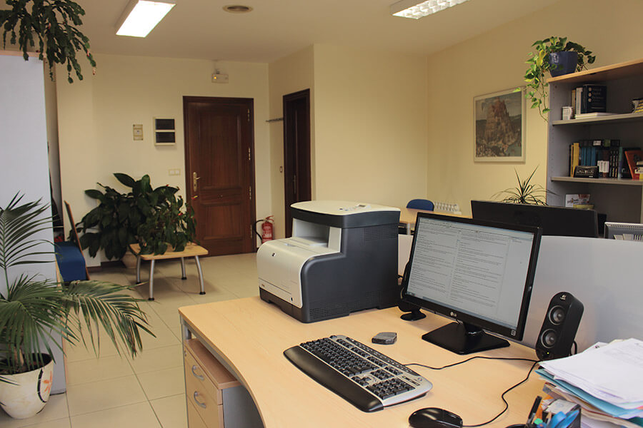
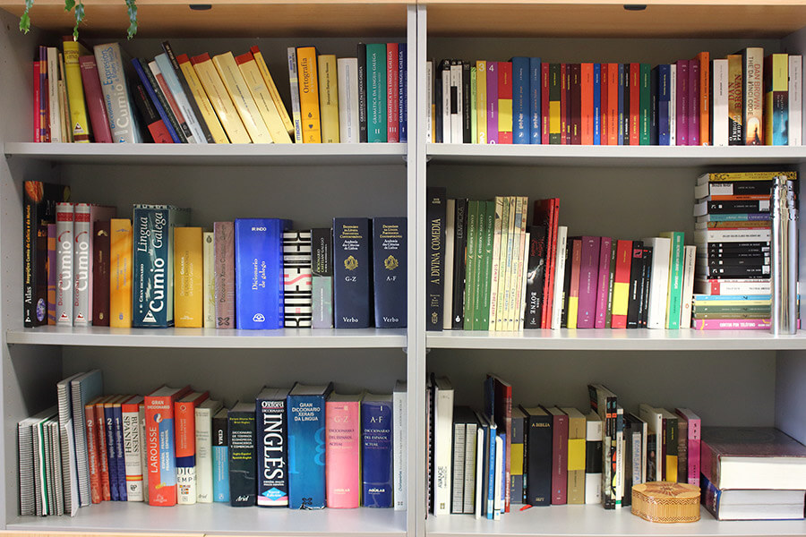

# Rosetta Traducción, Interpretación e Servicios Lingüísticos, S. L. L.

## Über uns

Rosetta ist ein Unternehmen mi Bereich Übersetzungsarbeiten und Vermittlung von Dolmetschern, das sich an Privatkunden und alle Arten von Unternehmen wendet. Wir blicken auf langjährige Erfahrung in diesen Bereichten zurück und können Ihnen Service anbieten, der auch höchsten Ansprüchen gewaschsen ist.

Schauen Sie sich doch einmal auf unserer Webseite um, Sie werden erstaunt sein, in welchen sprachlichten Bereich wir alles tätig sind. Wir  machen Ihnen gerne einen unverbindlichen Kostenvoranschlag für Ihren Auftrag und schneiden diesen ganz auf Ihre persönilichen Bedürfnisse zu.

 

 

-----

 

## Unsere Arbeitsweise

Im wirtschaftlichen und professionellen Umfeld unserer Welt gewinnen professionelle Fachkenntisse zunehmend an Bedeutung. Wenn für eine Aufgabe der geeignete Fachmann gefunden werden kann, dann spart das Zeit und Geld. Daraus ergibt sich die logishe Schlussfolgerunr, bei mehrsprachigen Projekten ein auf Übersetzungen spezialisiertes Unternehmen anzusprechen, um sowohl die Qualität als auch die Rentabilität des Projektes zu gewährleisten.

Unser Team von Fachleuten verfügt über einen anerkannten Universitätsabschluss und gleichzeitig auch über jahrelanfe Erfahrung imo Bereich internationale Kommunikation. Wir können daher qualitativ hochwertige Übersetzungen anbieten, Einhaltung der vereinbarten Liefertermine, Flexibilität in bezug auf die zu bearbeitenden Formate und salbstverständlich auch absolute Transparenz bei den Kostenvoranschlägen: Bei Rosetta sin Sie in guten, und vor Allem auch professionellen Händen.

 

 

-----

 

## Leistungen

Die Welt des 21. Jahrhunderts ist mehrsprachig und multikulturell ausgerichtet. Rosetta entspricht diesen Tendenzen und bietet eine Reihe von Leistungen an, die entworfen wurden, um über die sprachlichen und kulturellen Barrieren hinaus zu wirken.

Unabhänging davon, ob es sich um einen ausländischen Universitätstitel handelt, dessen amtliche Genehmigung Sie benötigen, ein Arbeitstreffen mit einem potenziellen Importeur, vielleicht aber auch eine durch Mehrsprachigkeit auffallende Website Ihres Unternehmens oder di Bedienungsanleitung der zuletz erworbenen Technologie; Rosetta bietet Ihnen genau die Lösung, mit der Sie den Erfolg Ihrer Unternehmungen garantieren können.

Wählen Sie die Art der Leistung aus, die Sie benötigen. Hier erhalten Sie weiterfürhende Informationen dazu.

- Übersetzung 
- Dolmentschen
- Sprachservice

 

### Übersetzung

Die Übersetzung ist die Übertragung eines geschriebenen Textes in eine andere Sprache. Vom Jahresbreicht Ihrer Handelgesesllchaft bis zu den ärztlichen Berichten, die von Ihrer Versicherungsgesellschaft eingefordert werden: im Leben taucht immer wieder der Bedarf für eine qualitativ hochwertige Übersetzung auf. Rosetta bietet Ihnen professionelle Lösungen in  diesem Bereich.

- Alle Sprachkombinationen: von den gebräuclichsten (z. Bsp: Englisch-Spaniscj) bis zu den exotischen (z. Bsp. Indonesisch-Französische?
- Mehrere Fachgebiete: akademische, medizinische, wirtschaftliche, finanzielle, touristische u. a. Übersetzungen.
- Formate und Spreichermedium nah Maß: als Papierausdruck, per E-Mail oder Fax, auf CD usw.
- Beglaubigte Übersetzungen: mit amtlicher Beglaubigung durch von den Behörden emächtligten Übersetzern,
- Maßgeschneiderte Liefertermine: von dringenden Eilauftägen bis zu Projekten, die über mehrere Monate in Anspruch nehmen.                       

 

### Dolmentischen

Das Dolmetische (die mündliche Übersetzung) betuht auf der Übersetzung der mündlichen Sprache in eine andere. Von ainem Arbeitstreffen mit einme potenziellen Käufer. In vielen Fällen ist die Erfahrung eines professionallen Dolmentischers unentbehrlich. Rosetta bietet Ihnen die entsprechenden Lösungen mit einem umfassenden Angebot an Servicepaketen.

- **Simultandolmetschen:** auf Kongressen und Konferenzen mit dem Publikum die Übersetzung über Kopfhörer zugetragen.
- **Konsekutivdoletschen:** auf Plenaversammlungen oder Presserunden – der Dolmetscher übersetzt den Vortrag des Redners nach dessen Beendigung (oft auch schon nach mehreren Sätzen im Block)
- **Verhandlungsdolmetschen:** auf Versammlungen und Verhandlungen – der Dolmerscher tritt als Sprachbrücle zwischen den einzelnen Parteien auf.
- **Begleitung:** der Dolmetscher unterstützt den Kunden während des gesamten Kommunikationsprozesses.
- **Vereidigt:** bei offiziellen Instanzen – der Dolmetscher übersetzt die Vorträge mit der amtlichen Bestätigung durch die entsprechenden Behörden.

 

### ⁠⁠⁠Sprachservice

Gerade mi Zeitalter der Kommunikation ist es ausgesprochen wichtig, gut mit Worten umgehen zu können. Rosetta verschaft Ihren Inhalten diesen letzten Schliff, damit Ihr geschriebenes Wort mit der höchstmöglichen Qualität abgeliefert werden kann.

- Überprüfung der Texte
- Stilistische Überarbeitung
- Korrektur Rechtschreibung und Grammatik
- Bearbeitung von Glossaren
- Fachsprachliche Beratung
- Kreative Übersetzung von Werbetexten
- Transkriptionen von Audio und Video
- Technische Redaktion
- Linguistische Gutachten
- Beeidigte Beglaubigung der Übersetzungen

 

-----

 

## Tarife

Rosetta passt sich auch, was die Preise angeht, an die Bedürfnisse des Kunden, die unterschiedlichen Sprachserviceangebote, Sprachkombinationen, Art der Texte, Lieferfristen und Arbeitsvolumen an. Des Weiteren geben wir Sonderrabatte für bestimmte Kollektive und Kundenprofile.

Der Preis eines Übersetzungsauftrags wird normalerweise nach Wortanzahl berechnet; der eines Dolmentscherauftrages berechnet sich nach Stundenzahl; die Beträge anderer Sprachdienstleistungen hängen von den entsprechenden Abmachungen ab.

Setzen Sie sich mit uns in Verbindung, wir unterbreiten Ihnen gerne einen individuell auf Sie zugeschnittenen und unverbindlichen Kostenvoranschlag.

 

-----

 

## Kontakt

Um über Ihre konreten Bedürfnisse zu sprechen oder weitere Informationen zu erbitten, wenden Sie sich bitte unverbindlich an das fachmännische Serviceteam von Rosetta.

 
<iframe src="https://www.google.com/maps/embed?pb=!1m18!1m12!1m3!1d2954.043204963049!2d-8.72523202347783!3d42.23488994299962!2m3!1f0!2f0!3f0!3m2!1i1024!2i768!4f13.1!3m3!1m2!1s0xd2f626b981bc823%3A0x647456fd3cbe29be!2sRonda%20de%20Don%20Bosco%2C%2030%2C%20Santiago%20de%20Vigo%2C%2036203%20Vigo%2C%20Pontevedra!5e0!3m2!1ses!2ses!4v1727477964429!5m2!1ses!2ses" width="600" height="450" style="border:0;" allowfullscreen="" loading="lazy" referrerpolicy="no-referrer-when-downgrade"></iframe>
 

Rosetta Traducción, Interpretación e Servicios Lingüísticos SLL
Ronda de Don Bosco, 30, 3ºA
E-36202 Vigo

ESPAÑA

Tel-Fax: +34 986 10 32 76

[info@rosettaonline.net](mailto:info@rosettaonline.net)

 

-----

 

## Der Rosetta-Stein

In Jahr 1799 fand ein französischer Soldat, der an der nordafrikanischen Expedition von Napoleon Bonaparte teilnahm, in der Nahe der ägyptischen Hafens von Rosetta (heute Raschid) ein Fragment aus schwarzem Basalt von 115 cm Länge und 75 cm Breite.

Der Stein entpuppte sich als Teil einer Platte aus dem 2. Jhd. v. Chr., auf dem ein Dekret in drei verschiedenen Schriften eingemeißelt wurde: Hieroglyphen, Demotisch und Griechisch. Der französische Ägyptologue Jean-François Champollion verglich die drei Versionen und es gelang ihm auf diese Weise, ein tausendjähriges Geheimnis zu ergründen: Danñ dieses Steines konnte er num endlich das Rätsel der ägyptischen Hieroglyphen entziffern.

Der Rosetta-Stein, der heute im Britischen Museum aufbewahrt wird, bildet einen der schönsten und faszinierenden Marksteine der universellen Geschichte der Übersetzung.

