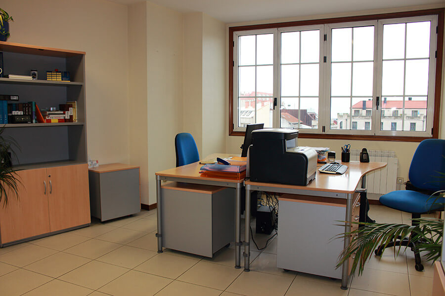
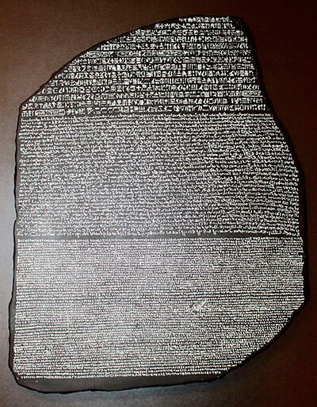

# Rosetta Traducción, Interpretación e Servicios Lingüísticos, S. L. L.

## Quen somos

Rosetta é unha empresa de tradución e interpretación que pretende responder ás necesidades dos clientes particulares e das empresas. Combinando experiencia, formación especializada e profesionalismo, ofrecémoslle un servizo de calidade á altura das súas expectativas.

Convidámolo a navegar pola nosa web para explorar as competencias lingüísticas que Rosetta pon á súa disposición. Se desexa un estudo persoal das súas necesidades específicas, non dubide en pórse en contacto connosco, sen compromiso ningún.

 

 

-----

 

## Como traballamos

No tecido económico e profesional do mundo en que vivimos, a especialización profesional é un valor en alza e asignarlle cada tarefa ao profesional adecuado supón un aforro de tempo e cartos. Por iso, cando xorden necesidades interlingüísticas o lóxico é recorrer a unha empresa especializada en tradución e interpretación. Rosetta responde a esas necesidades ofrecendo calidade e profesionalismo nos seus servizos.

O noso equipo de profesionais garante a calidade que só pode provir dunha formación universitaria especializada e o valor engadido dunha ampla experiencia. Opte pola seriedade dos prazos cumpridos, pola flexibilidade dos formatos á carta, pola transparencia dos orzamentos personalizados: Rosetta é a tranquilidade de estar en mans profesionais.

 

 

-----

 

## Servizos

O mundo do século XXI é plurilingüe e multicultural. Rosetta responde ás necesidades xurdidas desta realidade ofrecendo todo un abano de servizos deseñados para trascender as fronteiras lingüísticas e culturais.

Do título universitario estranxeiro que desexa homologar á reunión de traballo cun potencial importador, pasando pola flamante páxina web multilingüe da súa empresa ou polo manual de instruccións da última adquisición tecnolóxica: Rosetta responde ofrecéndolle xustamente o que precisa.

Seleccione o tipo de servizo que procura e obterá máis información ao respecto:

- Tradución
- Interpretación
- Servizos lingüísticos

 

### Tradución

A tradución é a pasaxe dun texto escrito nunha lingua para outra lingua diferente. Da memoria anual da súa sociedade mercantil aos relatorios médicos que lle esixe a súa compañía de seguros: ao longo da vida xorden constantemente necesidades de tradución. Rosetta é a resposta profesional a esas necesidades.

- Todas as combinacións de linguas: desde as máis frecuentes (por ex: inglés-español) ata as máis exóticas (por ex. indonesio-francés)
- Múltiples áreas de especialización: tradución académica, médica, comercial, financeira, turística...
- Formatos e soportes á carta: en papel, por correo electrónico, por fax, en CD...
- Tradución xurada: coa certificación oficial de traductores habilitados polas autoridades. 
- Prazos á súa medida: desde a tradución urxente de última hora a proxectos de varios meses.

 

### Interpretación

A interpretación (tradución oral) consiste en verter a outra lingua as palabras dun falante. Desde unha reunión de traballo cun potencial importador do seu produto á venda dunha propiedade a un comprador estranxeiro: en ocasións resulta imprescindible a pericia dun intérprete profesional. Rosetta responde cunha completa gama de servizos:

- **Interpretación simultánea:** en congresos e conferencias, o público recibe a tradución por medio de auriculares.
- **Interpretación consecutiva:** en conferencias plenarias ou de prensa, o intérprete traduce o discurso do orador unha vez rematado.
- **Interpretación de enlace:** en reunións de negocios, o intérprete fai de ponte lingüística entre as partes.
- **De acompañamento:** o intérprete asiste o cliente en todas as súas interaccións de comunicación.
- **Interpretación xurada:** en institucións oficiais, o intérprete verte os discursos coa habilitación oficial das autoridades.                         

 

### Servizos lingüísticos

Na era da comunicación é fundamental manexar correctamente a palabra. Rosetta proporciónalle ese toque final aos seus contidos para que cheguen aos destinatarios coa óptima calidade que merecen:

- revisión de textos
- corrección de estilo
- normalización de textos en lenguas autonómicas
- elaboración de glosarios
- consultoria terminolóxica
- tradución creativa de publicidade
- transcripcións de audio e vídeo
- redacción técnica
- peritaxe lingüística
- certificación xurada de traducións

 

-----

 

## Prezos

Rosetta aplica unha política de prezos flexibles que se adaptan ás diferentes posibilidades de servizos lingüísticos, combinacións de linguas, tipos de textos, prazos de entrega e volúmenes de traballo. Existen, ademáis, descontos especiais para determinados colectivos e perfís de clientes.

O prezo dun servizo de tradución adoita calcularse consonte o número de palabras, ou no caso dunha interpretación polas horas de traballo; os prezos doutros servizos lingüísticos dependen das características particulares de cada servizo.

Convidámolo a pórse en contacto connosco para que poidamos estudar o seu proxecto particular e enviarlle un orzamento personalizado, sen compromiso ningún.

 

-----

 

## Contacte connosco

Para falar das súas necesidades específicas ou para solicitar máis informacións, diríxase sen compromiso ningún ao equipo de profesionais de Rosetta.

[gimmick:googlemaps(maptype: 'satellite', zoom: 17)](Ronda de Don Bosco, 30, Vigo, Spain)

Rosetta Traducción, Interpretación e Servicios Lingüísticos SLL
Ronda de Don Bosco, 30, 3ºA
E-36202 Vigo

ESPAÑA

Tel-Fax: +34 986 10 32 76

[info@rosettaonline.net](mailto:info@rosettaonline.net)

 

-----

 

## A pedra de Rosetta

En 1799, un soldado francés que formaba parte da expedición norteafricana de Napoleón Bonaparte encontrou preto do porto exipcio de Rosetta (actual Rashid) un fragmento de basalto negro duns 115 cm de longo e 75 cm de largo.

A pedra era parte dunha estela do século II a.C. que tiña gravado un decreto en tres alfabetos diferentes: xeroglífico, demótico e grego. O exiptólogo francés Jean-François Champollion comparou as tres versións e, deste modo, conseguiu descifrar un misterio milenario: grazas á pedra descrifrou, por fin, o enigma da escrita xeroglífica.

A pedra de Rosetta, conservada hoxe no Museo Británico, constitúe un dos fitos máis belos e fascinantes da historia universal da tradución.

