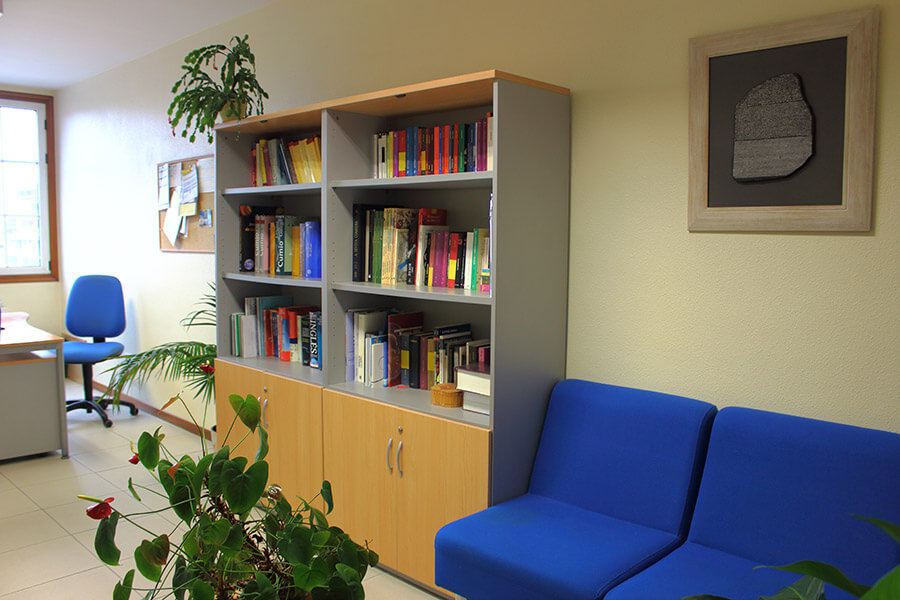

# Rosetta Traducción, Interpretación e Servicios Lingüísticos, S. L. L.

## Quiénes somos

Rosetta es una empresa de traducción e interpretación que responde a las demandas de clientes particulares y empresas. Combinando experiencia, formación especializada y profesionalidad, le ofrecemos un servicio de calidad a la altura de sus expectativas.

Le invitamos a navegar por nuestra web para explorar las competencias lingüísticas que Rosetta pone a su disposición. Si desea un estudio personal de sus necesidades específicas, no dude en ponerse en contacto con nosotros, sin ningún compromiso.

 

 

-----

 

## Cómo trabajamos

En el tejido económico y profesional del mundo en que vivimos, la especialización profesional es un valor en alza y asignar cada tarea al profesional adecuado es un ahorro de tiempo y dinero. Por ello, cuando surgen necesidades interlingüísticas el paso lógico es recurrir a una empresa especializada en traducción e interpretación. Rosetta responde a esas necesidades ofreciendo calidad y profesionalidad en sus servicios.

Nuestro equipo de profesionales le garantiza la calidad que sólo puede provenir de una formación universitaria especializada y el valor añadido de una amplia experiencia. Opte por la seriedad de los plazos cumplidos, la flexibilidad de los formatos a la carta, la transparencia de los presupuestos personalizados: Rosetta es la tranquilidad de saberse en manos de profesionales.

 

 

-----

 

## Servicios

El mundo del siglo XXI es plurilingüe y multicultural. Rosetta responde a las demandas surgidas de esta realidad ofreciendo toda una gama de servicios diseñados para trascender las fronteras lingüísticas y culturales.

Desde el título universitario extranjero que desea homologar hasta la reunión de trabajo con un potencial importador, pasando por la flamante página web multilingüe de su empresa o el manual de instrucciones de la última adquisición tecnológica: Rosetta responde ofreciéndole justamente lo que precisa.

Seleccione el tipo de servicio que demanda y obtendrá más información al respecto:

- Traducción
- Interpretación
- Servicios lingüísticos

 

### Traducción

La traducción es el paso de un texto escrito a una lengua diferente. Desde la memoria anual de su sociedad mercantil a los informes médicos que le requiere su compañía aseguradora: en la vida surgen constantemente necesidades de traducción. Rosetta es la respuesta profesional a esas necesidades.

- Todas las parejas de lenguas: desde las más usuales (ej. inglés-español) hasta las más exóticas (ej. indonesio-francés)
- Múltiples campos de especialización: traducción académica, médica, comercial, financiera, turística...
- Formatos y soportes a la carta: en papel, por correo electrónico, por fax, en CD...
- Traducción jurada: con la certificación oficial de traductores habilitados por las autoridades. 
- Plazos a su medida: desde la traducción urgente de última hora hasta proyectos de varios meses.

 

### Interpretación

La interpretación (traducción oral) consiste en verter en otro idioma las palabras de un hablante. Desde una renión de trabajo con un potencial importador de su producto hasta la venta de una propiedad a un comprador extranjero: en ocasiones es imprescindible la pericia de un intérprete profesional. Rosetta responde con una completa gama de servicios:

- **Interpretación simultánea:** en congresos y conferencias, el público recibe la traducción por medio de auriculares.
- **Interpretación consecutiva:** en conferencias plenarias o ruedas de prensa, el intérprete traduce el discurso del orador cuando éste lo completa.
- **Interpretación de enlace:** en reuniones o negociaciones, el intérprete hace de puente lingüístico entre las partes.
- **De acompañamiento:** el intérprete asiste al cliente en todas sus interacciones de comunicación.
- **Jurada:** en instancias oficiales, el intérprete vierte los discursos con la habilitación oficial de las autoridades.                         

 

### Servicios lingüísticos

En la era de la comunicación es importante hacer un manejo impecable de la palabra. Rosetta proporciona ese toque final a sus contenidos para que lleguen a sus destinatarios con la óptima calidad que se merecen.

- revisión de textos
- corrección de estilo
- normativización de textos en lenguas autonómicas
- elaboración de glosarios
- consultoría terminológica
- traducción creativa de publicidad
- transcripciones de audio y vídeo
- redacción técnica
- peritaje lingüístico
- certificación jurada de traducciones

 

-----

 

## Tarifas

Rosetta aplica una política de precios flexibles que se adaptan a las diferentes posibilidades de servicios lingüísticos, combinaciones de lenguas, tipos de textos, plazos de entrega y volúmenes de trabajo. Existen, además, descuentos especiales para determinados colectivos y perfiles de clientes.

El precio de un servicio de traducción suele calcularse según el número de palabras; el de una interpretación, por hora de trabajo; los importes de otros servicios lingüísticos dependen de sus características particulares.

Le invitamos a ponerse e contacto con nosotros para que estudiemos su proyecto particular y le remitamos un presupuesto personalizado, sin ningún compromiso.

 

-----

 

## Contacte con nosotros

Para hablar de sus necesidades concretas o solicitar más información, diríjase sin compromiso al equipo de profesionales de Rosetta.

[gimmick:googlemaps(maptype: 'satellite', zoom: 17)](Ronda de Don Bosco, 30, Vigo, Spain)

Rosetta Traducción, Interpretación e Servicios Lingüísticos SLL
Ronda de Don Bosco, 30, 3ºA
E-36202 Vigo

ESPAÑA

Tel-Fax: +34 986 10 32 76

[info@rosettaonline.net](mailto:info@rosettaonline.net)

 

-----

 

## La piedra de Rosetta

En 1799, un soldado francés que formaba parte de la expedición norteafricana de Napoleón Bonaparte encontró cerca del puerto egipcio de Rosetta (actual Rashid) un fragmento de basalto negro de unos 115 cm de largo y 75 cm de ancho.

La piedra resultó ser parte de una estela del siglo II a.C. en la que se había grabado un decreto en tres alfabetos diferentes: jeroglífico, demótico y griego. El egiptólogo francés Jean-François Champollion comparó las tres versiones y consiguió así desentrañar un misterio milenario: gracias a la piedra descrifró, por fin, el enigma de la escritura jeroglífica.

La piedra de Rosetta, conservada hoy en el Museo Británico, constituye uno de los hitos más bellos y fascinantes de la historia universal de la traducción.

